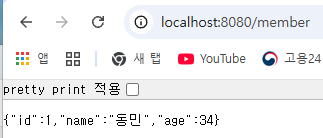
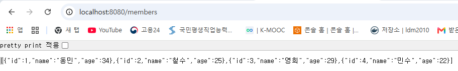

# spring-boot-member-api

Spring Boot로 회원 CRUD API를 단계별로 구현하는 학습 프로젝트입니다. 실습이 진행될 때마다 기능과 실행 방법을 이 문서에 누적합니다.

## 기술 스택

- Java 21
- Spring Boot 4.1.0
- Gradle

## 현재 구현

### `GET /hello`

간단한 문자열을 반환합니다.

```text
hello
```

### `GET /member`

회원 객체를 JSON으로 반환합니다.

```json
{
  "id": 1,
  "name": "동민",
  "age": 34
}
```

### `GET /members`

현재 메모리에 저장된 회원 목록을 JSON 배열로 반환합니다.

### `POST /members`

요청 본문의 회원 JSON을 메모리 목록에 추가합니다. 아직 데이터베이스를 사용하지 않으므로 서버를 재시작하면 추가한 회원은 사라집니다.

## 실행 화면

### Spring Boot 서버 정상 실행


### Hello API 응답


### 단일 회원 JSON 응답



### 회원 목록 JSON 응답


### POST 등록 후 GET 목록 반영(메모리 저장)

`POST /members`로 민수(`id=4`)를 등록한 뒤 `GET /members`에서 네 명의 회원이 함께 조회되는 것을 확인했습니다.



## 실행 방법

Windows에서 다음 명령으로 애플리케이션을 실행합니다.

```powershell
.\gradlew.bat bootRun
```

실행 후 아래 주소에서 응답을 확인할 수 있습니다.

- `http://localhost:8080/hello`
- `http://localhost:8080/member`
- `http://localhost:8080/members`

## 진행 계획

- 회원 목록 및 상세 조회 API
- 회원 생성, 수정, 삭제 API
- JPA와 데이터베이스 연동
- 테스트 및 예외 처리
- Docker 이미지 구성
- AWS/Kubernetes 배포
