# spring-boot-member-api

Spring Boot로 회원 CRUD REST API를 구현하고 MySQL 영속화, Docker 컨테이너화, Kubernetes 배포까지 완료한 학습 프로젝트입니다.

## 기술 스택

- Java 21
- Spring Boot 4.1.0
- Gradle 9.5.1
- Spring Web MVC
- Spring Data JPA
- H2 (학습 및 테스트 단계)
- MySQL 8.4.11
- Docker
- Kubernetes

## 아키텍처

```text
Client -> Controller -> Service -> Repository -> JPA -> MySQL
```

- `Controller`: HTTP 요청과 응답 처리
- `Service`: 회원 CRUD 로직 처리
- `Repository`: Spring Data JPA를 통한 데이터 접근
- `MySQL`: 애플리케이션과 분리된 영구 데이터 저장소

Kubernetes 환경에서는 다음 전체 경로를 검증했습니다.

```text
Browser -> port-forward -> Kubernetes Service -> Spring Boot Pod -> JPA -> MySQL
```

## CRUD API

| Method | Endpoint | 설명 |
| --- | --- | --- |
| `GET` | `/hello` | 서버 동작 확인 |
| `GET` | `/members` | 회원 전체 조회 |
| `GET` | `/members/{id}` | 회원 단건 조회 |
| `POST` | `/members` | 회원 등록 |
| `PUT` | `/members/{id}` | 회원 수정 |
| `DELETE` | `/members/{id}` | 회원 삭제 |

`POST`와 `PUT` 요청 본문 예시:

```json
{
  "name": "동민",
  "age": 34
}
```

초기 학습용 `GET /member`는 최종 코드에서 제거했습니다. `docs/images/`에 남아 있는 관련 화면은 단계별 학습 기록입니다.

## 구현 기능

- [x] Spring Boot 서버와 `GET /hello`
- [x] 회원 전체·단건 조회
- [x] 회원 등록·수정·삭제
- [x] Controller / Service / Repository 계층 분리
- [x] Spring Data JPA 적용
- [x] H2 학습 및 테스트
- [x] MySQL 연동과 영구 저장 확인
- [x] Docker 이미지 빌드와 컨테이너 실행
- [x] Kubernetes Deployment / Service 배포
- [x] Kubernetes Service를 통한 API·MySQL 통합 확인

## 데이터 저장 방식 변화

```text
초기: Repository -> ArrayList
      서버 재시작 시 데이터 소멸

중간: Repository -> JPA -> H2

최종: Repository -> JPA -> MySQL
      Spring Boot 재시작 후에도 데이터 유지
```

## 로컬 실행

MySQL 8.4에 `spring_crud` 데이터베이스와 애플리케이션 사용자를 준비한 뒤 환경 변수를 설정합니다. 실제 비밀번호는 파일이나 Git에 기록하지 않습니다.

```powershell
$env:DB_URL = 'jdbc:mysql://localhost:3306/spring_crud'
$env:DB_USERNAME = 'springuser'
$env:DB_PASSWORD = Read-Host 'MySQL password'
./gradlew.bat bootRun
```

실행 후 `http://localhost:8080/hello`와 `http://localhost:8080/members`에서 응답을 확인할 수 있습니다.

테스트는 별도의 인메모리 H2 설정을 사용하므로 로컬 MySQL이나 비밀번호 없이 실행할 수 있습니다.

```powershell
./gradlew.bat test
```

## Docker 실행

```powershell
./gradlew.bat clean bootJar
docker build -t spring-crud:latest .
docker run --rm -p 8080:8080 `
  --env DB_URL=jdbc:mysql://host.docker.internal:3306/spring_crud `
  --env DB_USERNAME=springuser `
  --env DB_PASSWORD `
  spring-crud:latest
```

`--env DB_PASSWORD`는 현재 셸의 환경 변수 값을 컨테이너에 전달하며 이미지나 저장소에 비밀번호를 저장하지 않습니다.

## Kubernetes 실행

다음 예시는 로컬 Docker Desktop Kubernetes와 `spring-crud:latest` 이미지를 기준으로 합니다.

```powershell
kubectl create secret generic spring-crud-db-secret `
  --from-literal=username="$env:DB_USERNAME" `
  --from-literal=password="$env:DB_PASSWORD"
kubectl apply -f deployment.yaml
kubectl apply -f service.yaml
kubectl port-forward service/spring-crud-service 8080:8080
```

`deployment.yaml`에는 비밀번호가 없으며 Kubernetes Secret의 `username`, `password` 키를 참조합니다.

## 실행 및 검증 화면

### 1. Spring Boot와 CRUD

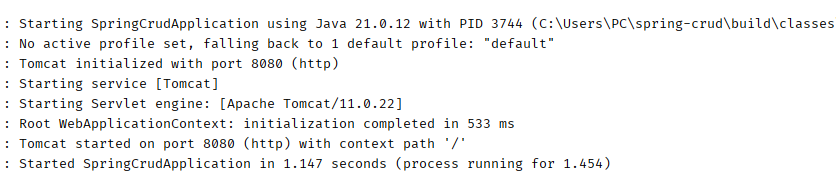

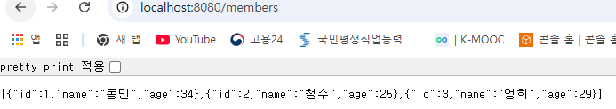

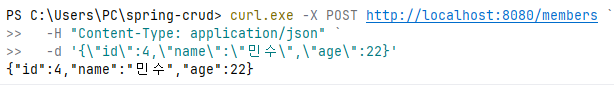

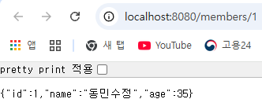

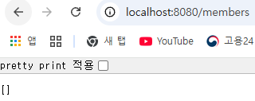

### 2. JPA와 데이터베이스 영속성

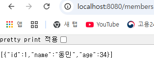

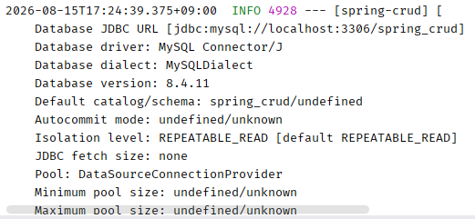

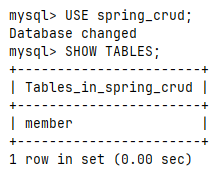

Spring Boot를 재시작한 뒤 API와 MySQL에서 같은 회원 데이터가 유지되는 것을 확인했습니다.

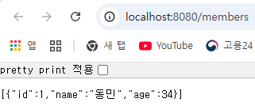

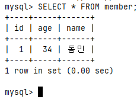

### 3. Docker 컨테이너화

```text
Docker image build -> container run -> MySQL 연결 -> GET /members 조회
```

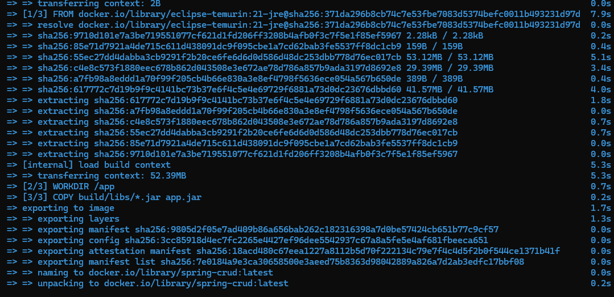

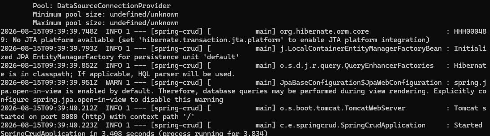

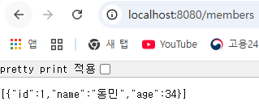

### 4. Kubernetes 배포

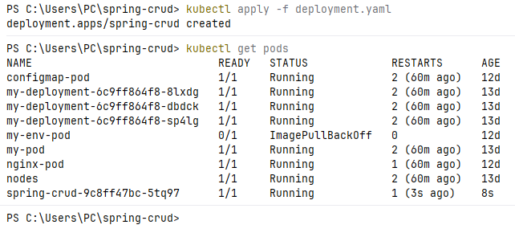

DB Secret을 바로잡고 재시작 횟수 없이 `1/1 Running`이 된 상태입니다.

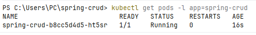

Service를 포트 포워딩한 뒤 브라우저에서 MySQL 회원 데이터를 조회했습니다.

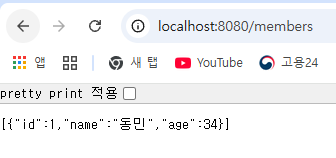

그 밖의 단계별 캡처는 [`docs/images/`](docs/images/)에서 확인할 수 있습니다.

## 트러블슈팅

### Java 8 대신 Java 21 적용

기존 Java 8이 먼저 인식되어 애플리케이션을 실행할 수 없었습니다. Temurin JDK 21을 설치하고 `JAVA_HOME`과 Windows `PATH`를 수정한 뒤 새 터미널에서 Java 21 적용을 확인했습니다.

### MySQL 명령 PATH 등록

MySQL 설치 후 `mysql` 명령을 찾지 못해 다음 경로를 Windows `PATH`에 추가하고 새 터미널에서 확인했습니다.

```text
C:\Program Files\MySQL\MySQL Server 8.4\bin
```

### Kubernetes `CrashLoopBackOff` 해결

Pod가 반복 재시작되어 `kubectl logs <pod-name> --previous`로 직전 컨테이너 로그를 확인했습니다. MySQL `Access denied`를 원인으로 특정한 뒤 `spring-crud-db-secret`을 올바른 사용자명과 비밀번호로 다시 생성하고 Deployment를 재시작했습니다. 그 결과 Pod가 `1/1 Running` 상태가 되었고 Service를 통해 `/members` 조회까지 확인했습니다.

## 보안 설정

MySQL 비밀번호와 Kubernetes Secret 값은 저장소에 커밋하지 않습니다. 애플리케이션 설정은 환경 변수만 참조합니다.

```properties
spring.datasource.url=${DB_URL:jdbc:mysql://localhost:3306/spring_crud}
spring.datasource.username=${DB_USERNAME:springuser}
spring.datasource.password=${DB_PASSWORD}
```

## 다음 단계

- Bash/Python 운영 자동화 기초
- AWS 배포 및 자격증 준비
